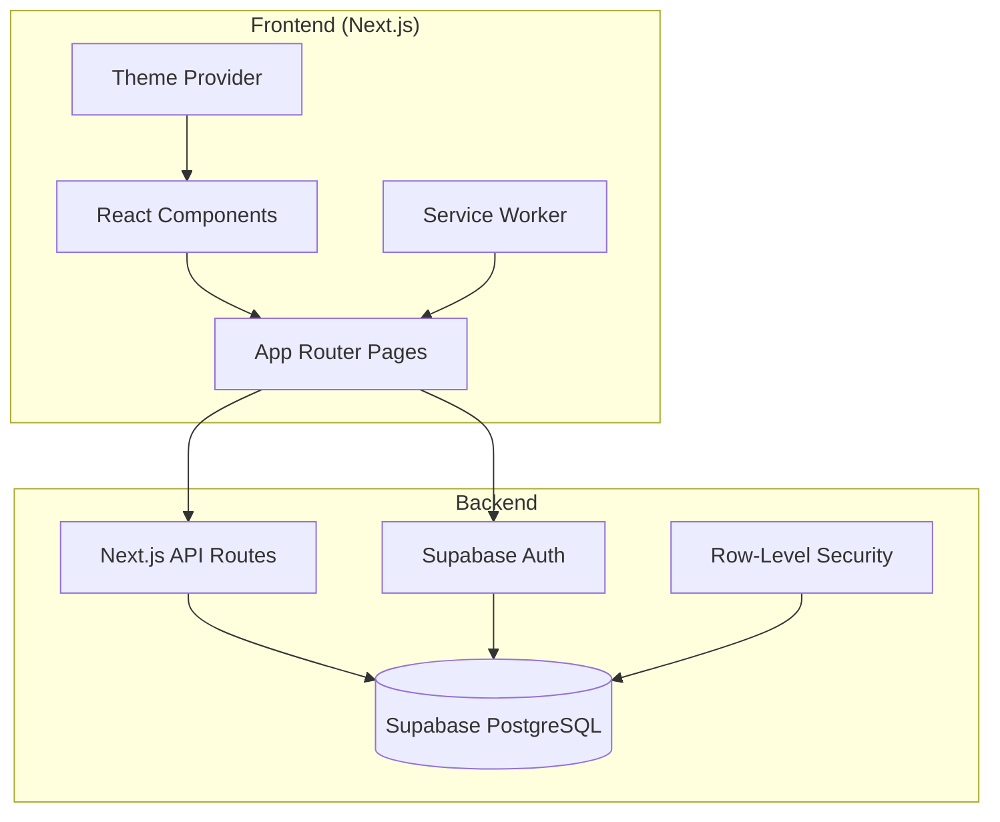
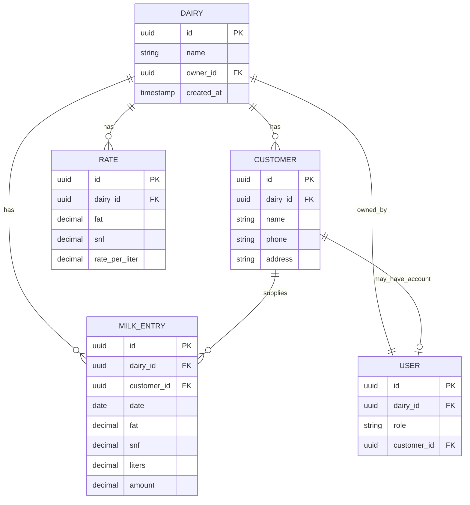

# Design Document

## Overview

GhostMilk is a multi-tenant SaaS application for digitizing dairy milk collection records. Built with Next.js (App Router) and Supabase, it provides dairy owners with customer management, milk entry recording, rate configuration, and analytics dashboards. Customers can access a portal to view their entries and summaries.

The application features a dual-theme system: a spooky Halloween theme for hackathon presentation and a clean professional theme for production SaaS deployment. Theme switching is controlled via environment variables.

## Architecture



### Key Architectural Decisions

1. **Next.js App Router**: Server components for data fetching, client components for interactivity
2. **Supabase**: Unified auth, database, and real-time capabilities
3. **Row-Level Security**: Database-level tenant isolation using dairy_id
4. **Theme System**: CSS variables + Tailwind for theme switching
5. **PWA**: Service worker for offline support and installability

## Components and Interfaces

### Authentication Module

```typescript
interface AuthService {
  signIn(email: string, password: string): Promise<AuthResult>;
  signUp(email: string, password: string, dairyName: string): Promise<AuthResult>;
  signOut(): Promise<void>;
  getSession(): Promise<Session | null>;
  getUser(): Promise<User | null>;
}

interface AuthResult {
  success: boolean;
  user?: User;
  error?: string;
}

interface User {
  id: string;
  email: string;
  role: 'owner' | 'customer';
  dairy_id: string;
  customer_id?: string;
}
```

### Customer Management Module

```typescript
interface CustomerService {
  create(customer: CreateCustomerInput): Promise<Customer>;
  getById(id: string): Promise<Customer | null>;
  list(filters?: CustomerFilters): Promise<Customer[]>;
  update(id: string, data: UpdateCustomerInput): Promise<Customer>;
  delete(id: string): Promise<void>;
  search(query: string): Promise<Customer[]>;
}

interface Customer {
  id: string;
  dairy_id: string;
  name: string;
  phone?: string;
  address?: string;
  created_at: string;
  updated_at: string;
}

interface CreateCustomerInput {
  name: string;
  phone?: string;
  address?: string;
}

interface CustomerFilters {
  search?: string;
  limit?: number;
  offset?: number;
}
```

### Milk Entry Module

```typescript
interface MilkEntryService {
  create(entry: CreateMilkEntryInput): Promise<MilkEntry>;
  getById(id: string): Promise<MilkEntry | null>;
  listByDate(date: string): Promise<MilkEntry[]>;
  listByCustomer(customerId: string, dateRange?: DateRange): Promise<MilkEntry[]>;
  update(id: string, data: UpdateMilkEntryInput): Promise<MilkEntry>;
  delete(id: string): Promise<void>;
}

interface MilkEntry {
  id: string;
  dairy_id: string;
  customer_id: string;
  date: string;
  fat: number;
  snf: number;
  liters: number;
  amount: number;
  created_at: string;
}

interface CreateMilkEntryInput {
  customer_id: string;
  date: string;
  fat: number;
  snf: number;
  liters: number;
}

interface MilkEntryValidation {
  isValid: boolean;
  errors: ValidationError[];
}

interface ValidationError {
  field: string;
  message: string;
}
```

### Rate Configuration Module

```typescript
interface RateService {
  setRate(fat: number, snf: number, ratePerLiter: number): Promise<Rate>;
  getRate(fat: number, snf: number): Promise<number | null>;
  calculateAmount(fat: number, snf: number, liters: number): Promise<number>;
  listRates(): Promise<Rate[]>;
  deleteRate(id: string): Promise<void>;
}

interface Rate {
  id: string;
  dairy_id: string;
  fat: number;
  snf: number;
  rate_per_liter: number;
  created_at: string;
}
```

### Dashboard/Summary Module

```typescript
interface SummaryService {
  getDailySummary(date: string): Promise<DailySummary>;
  getWeeklySummary(startDate: string): Promise<WeeklySummary>;
  getMonthlySummary(year: number, month: number): Promise<MonthlySummary>;
  getDateRangeSummary(startDate: string, endDate: string): Promise<DateRangeSummary>;
}

interface DailySummary {
  date: string;
  total_liters: number;
  total_amount: number;
  entry_count: number;
}

interface WeeklySummary {
  start_date: string;
  end_date: string;
  daily_breakdown: DailySummary[];
  total_liters: number;
  total_amount: number;
}

interface MonthlySummary {
  year: number;
  month: number;
  weekly_breakdown: WeeklySummary[];
  total_liters: number;
  total_amount: number;
}
```

### Theme System

```typescript
interface ThemeConfig {
  mode: 'spooky' | 'clean';
  colors: ThemeColors;
  animations: AnimationConfig;
}

interface ThemeColors {
  background: string;
  primary: string;
  accent: string;
  text: string;
  error: string;
}

interface AnimationConfig {
  enabled: boolean;
  ghostFloat: boolean;
  flickerText: boolean;
  fogOverlay: boolean;
  batsBackground: boolean;
}

// Spooky Theme Colors
const SPOOKY_COLORS: ThemeColors = {
  background: '#0A0A0F',
  primary: '#8A2BE2',
  accent: '#4BE1C3',
  text: '#F8F8FF',
  error: '#FF3B3B'
};

// Clean Theme Colors
const CLEAN_COLORS: ThemeColors = {
  background: '#FFFFFF',
  primary: '#3B82F6',
  accent: '#10B981',
  text: '#1F2937',
  error: '#EF4444'
};
```

## Data Models

### Database Schema (Supabase PostgreSQL)

```sql
-- Dairies table (tenants)
CREATE TABLE dairies (
  id UUID PRIMARY KEY DEFAULT gen_random_uuid(),
  name TEXT NOT NULL,
  owner_id UUID REFERENCES auth.users(id),
  created_at TIMESTAMPTZ DEFAULT NOW(),
  updated_at TIMESTAMPTZ DEFAULT NOW()
);

-- Users extension table
CREATE TABLE users (
  id UUID PRIMARY KEY REFERENCES auth.users(id),
  dairy_id UUID REFERENCES dairies(id),
  role TEXT NOT NULL CHECK (role IN ('owner', 'customer')),
  customer_id UUID REFERENCES customers(id),
  created_at TIMESTAMPTZ DEFAULT NOW()
);

-- Customers table
CREATE TABLE customers (
  id UUID PRIMARY KEY DEFAULT gen_random_uuid(),
  dairy_id UUID NOT NULL REFERENCES dairies(id),
  name TEXT NOT NULL,
  phone TEXT,
  address TEXT,
  created_at TIMESTAMPTZ DEFAULT NOW(),
  updated_at TIMESTAMPTZ DEFAULT NOW()
);

-- Milk entries table
CREATE TABLE milk_entries (
  id UUID PRIMARY KEY DEFAULT gen_random_uuid(),
  dairy_id UUID NOT NULL REFERENCES dairies(id),
  customer_id UUID NOT NULL REFERENCES customers(id),
  date DATE NOT NULL,
  fat DECIMAL(5,2) NOT NULL CHECK (fat >= 0 AND fat <= 15),
  snf DECIMAL(5,2) NOT NULL CHECK (snf >= 0 AND snf <= 15),
  liters DECIMAL(10,3) NOT NULL CHECK (liters > 0),
  amount DECIMAL(10,2) NOT NULL,
  created_at TIMESTAMPTZ DEFAULT NOW()
);

-- Rates table
CREATE TABLE rates (
  id UUID PRIMARY KEY DEFAULT gen_random_uuid(),
  dairy_id UUID NOT NULL REFERENCES dairies(id),
  fat DECIMAL(5,2) NOT NULL,
  snf DECIMAL(5,2) NOT NULL,
  rate_per_liter DECIMAL(10,2) NOT NULL,
  created_at TIMESTAMPTZ DEFAULT NOW(),
  UNIQUE(dairy_id, fat, snf)
);

-- Row-Level Security Policies
ALTER TABLE dairies ENABLE ROW LEVEL SECURITY;
ALTER TABLE customers ENABLE ROW LEVEL SECURITY;
ALTER TABLE milk_entries ENABLE ROW LEVEL SECURITY;
ALTER TABLE rates ENABLE ROW LEVEL SECURITY;

-- RLS Policy: Users can only access their dairy's data
CREATE POLICY dairy_isolation ON customers
  FOR ALL USING (dairy_id = (SELECT dairy_id FROM users WHERE id = auth.uid()));

CREATE POLICY entry_isolation ON milk_entries
  FOR ALL USING (dairy_id = (SELECT dairy_id FROM users WHERE id = auth.uid()));

CREATE POLICY rate_isolation ON rates
  FOR ALL USING (dairy_id = (SELECT dairy_id FROM users WHERE id = auth.uid()));
```

### Entity Relationships




## Correctness Properties

*A property is a characteristic or behavior that should hold true across all valid executions of a system-essentially, a formal statement about what the system should do. Properties serve as the bridge between human-readable specifications and machine-verifiable correctness guarantees.*

### Property 1: Customer Creation Tenant Association

*For any* valid customer input and authenticated dairy owner, creating a customer SHALL result in a customer record with dairy_id matching the owner's tenant.

**Validates: Requirements 2.1**

### Property 2: Tenant Data Isolation

*For any* database query executed by an authenticated user, the results SHALL contain only records where dairy_id matches the user's associated tenant.

**Validates: Requirements 2.2, 8.1**

### Property 3: Customer Update Round-Trip

*For any* existing customer and valid update input, updating the customer and then retrieving it SHALL return data matching the update input.

**Validates: Requirements 2.3**

### Property 4: Customer Deletion Exclusion

*For any* customer that has been deleted, subsequent queries for customers SHALL NOT include the deleted customer in results.

**Validates: Requirements 2.4**

### Property 5: Customer Search Tenant Filtering

*For any* search query executed by a dairy owner, all returned customers SHALL belong to that owner's tenant AND match the search criteria.

**Validates: Requirements 2.5**

### Property 6: Milk Entry Amount Calculation

*For any* milk entry with valid FAT, SNF, and liters values, the calculated amount SHALL equal the configured rate for that FAT/SNF combination multiplied by liters.

**Validates: Requirements 3.1**

### Property 7: Milk Entry Validation

*For any* milk entry input where FAT is outside [0.0, 15.0] OR SNF is outside [0.0, 15.0] OR liters is less than or equal to zero, validation SHALL reject the entry and return appropriate error messages.

**Validates: Requirements 3.2, 3.3, 3.4**

### Property 8: Milk Entry Date Filtering

*For any* date query, the returned milk entries SHALL contain exactly the entries where the entry date matches the query date AND dairy_id matches the user's tenant.

**Validates: Requirements 3.6**

### Property 9: Rate Storage Round-Trip

*For any* rate configuration with FAT, SNF, and rate_per_liter values, storing the rate and then retrieving it for the same FAT/SNF combination SHALL return the stored rate_per_liter value.

**Validates: Requirements 4.1**

### Property 10: Rate Update Non-Retroactivity

*For any* existing milk entries and subsequent rate update, the amounts on entries created before the rate update SHALL remain unchanged.

**Validates: Requirements 4.2**

### Property 11: Summary Aggregation Correctness

*For any* set of milk entries within a date range, the summary totals SHALL equal the sum of individual entry values (total_liters = Σ liters, total_amount = Σ amount, entry_count = count of entries).

**Validates: Requirements 5.1, 5.2, 5.3, 5.4**

### Property 12: Customer Portal Entry Isolation

*For any* authenticated customer user, the displayed milk entries SHALL contain only entries where customer_id matches the authenticated customer.

**Validates: Requirements 6.1**

### Property 13: Customer Entry Display Completeness

*For any* milk entry displayed to a customer, the display SHALL include FAT, SNF, liters, and amount fields with values matching the stored entry.

**Validates: Requirements 6.2**

### Property 14: Customer Summary Aggregation

*For any* customer viewing their monthly or historical summary, the displayed totals SHALL equal the sum of their individual entry values for the specified period.

**Validates: Requirements 6.3, 6.4**

### Property 15: Cross-Tenant Access Denial

*For any* user attempting to access data with a dairy_id different from their associated tenant, the system SHALL deny access and return an authorization error.

**Validates: Requirements 8.2**

## Error Handling

### Validation Errors

| Error Code | Condition | Response |
|------------|-----------|----------|
| `INVALID_FAT` | FAT outside 0.0-15.0 | "FAT must be between 0.0 and 15.0" |
| `INVALID_SNF` | SNF outside 0.0-15.0 | "SNF must be between 0.0 and 15.0" |
| `INVALID_LITERS` | Liters <= 0 | "Liters must be greater than 0" |
| `MISSING_RATE` | No rate for FAT/SNF | "No rate configured for this FAT/SNF combination" |
| `CUSTOMER_NOT_FOUND` | Invalid customer_id | "Customer not found" |

### Authentication Errors

| Error Code | Condition | Response |
|------------|-----------|----------|
| `INVALID_CREDENTIALS` | Wrong email/password | "Invalid email or password" |
| `SESSION_EXPIRED` | Token expired | "Session expired, please log in again" |
| `UNAUTHORIZED` | Cross-tenant access | "You do not have permission to access this resource" |

### Database Errors

| Error Code | Condition | Response |
|------------|-----------|----------|
| `DUPLICATE_CUSTOMER` | Customer name exists | "A customer with this name already exists" |
| `DUPLICATE_RATE` | Rate for FAT/SNF exists | "A rate for this FAT/SNF combination already exists" |
| `CONSTRAINT_VIOLATION` | FK or check constraint | "Operation failed due to data constraints" |

## Testing Strategy

### Property-Based Testing Library

**Library**: [fast-check](https://github.com/dubzzz/fast-check) for TypeScript/JavaScript

fast-check will be used to implement property-based tests that verify the correctness properties defined above. Each property test will run a minimum of 100 iterations with randomly generated inputs.

### Unit Testing

Unit tests will cover:
- Specific examples demonstrating correct behavior
- Edge cases (empty inputs, boundary values)
- Error condition handling
- Integration points between modules

### Test Organization

```
src/
  lib/
    validation.ts
    validation.test.ts        # Unit tests
    validation.property.test.ts  # Property tests
  services/
    customer.ts
    customer.test.ts
    customer.property.test.ts
    milk-entry.ts
    milk-entry.test.ts
    milk-entry.property.test.ts
    summary.ts
    summary.test.ts
    summary.property.test.ts
```

### Property Test Annotation Format

Each property-based test must be annotated with:
```typescript
/**
 * Feature: ghostmilk-core, Property 7: Milk Entry Validation
 * Validates: Requirements 3.2, 3.3, 3.4
 */
```

### Test Coverage Requirements

1. All validation functions must have property tests for valid/invalid input ranges
2. All CRUD operations must have round-trip property tests
3. All aggregation functions must have property tests verifying mathematical correctness
4. Tenant isolation must be verified through property tests with multi-tenant data